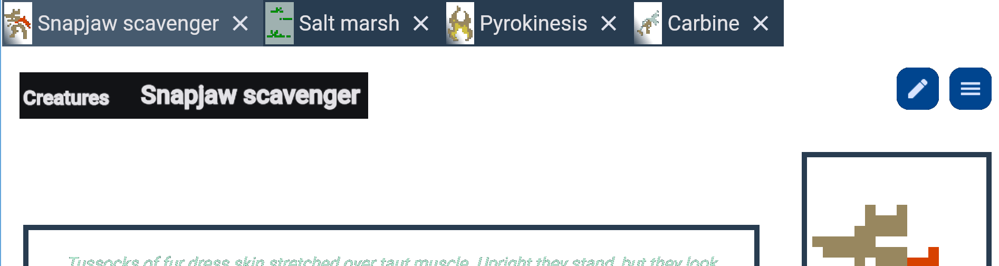
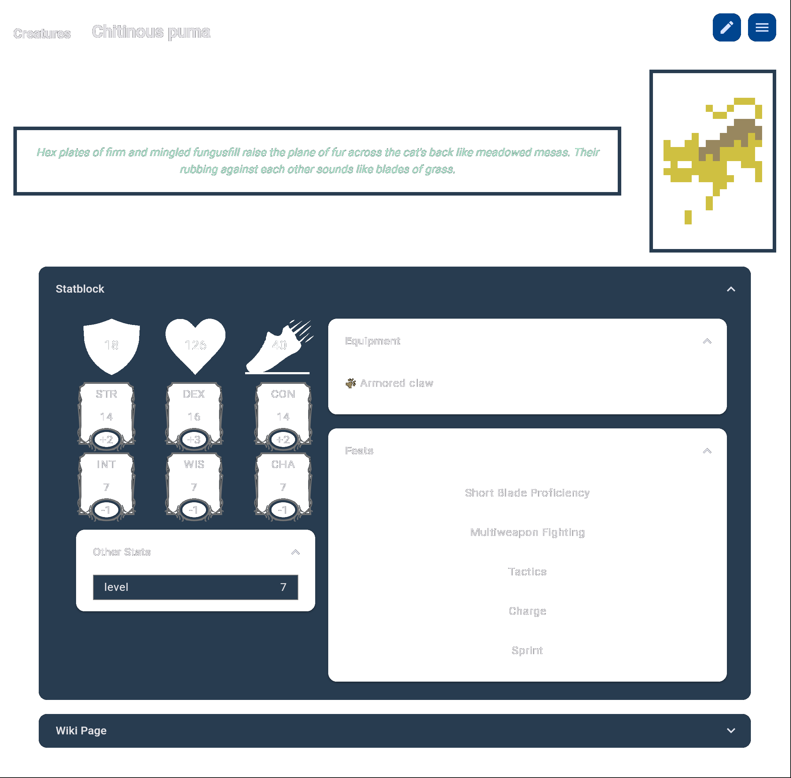
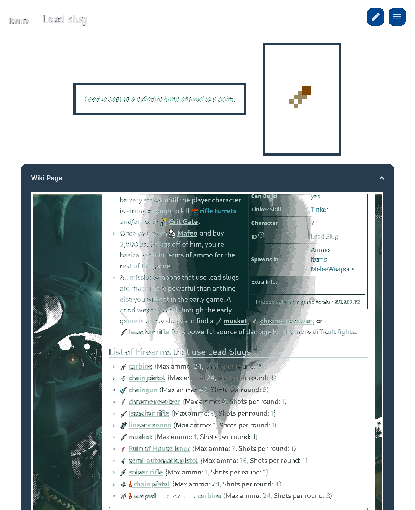

# quDnD
A stat generator/wiki browser for Caves of Qud that can create equivalent DnD statblocks on the fly.

## Features
### New! Tabs!
Tabs are automatically created when you visit a page.
When closed, you can bring them back up with Ctrl+Shift+T!

### Creature Statblocks, Equipment and Feats

### Embedded Wiki Page for Reference

## More to do
* Equipment stats (AC, damage, special effects)
* Links to equipment pages in creature statblocks
* Inventory item lists or examples for merchants
* Starting gear examples for creatures
* Ability to tweak stats and create custom pages
* Ability to save + load those custom pages

------

> [!NOTE]
> This project is in no way affiliated with Freehold Games or Kitfox Games.
