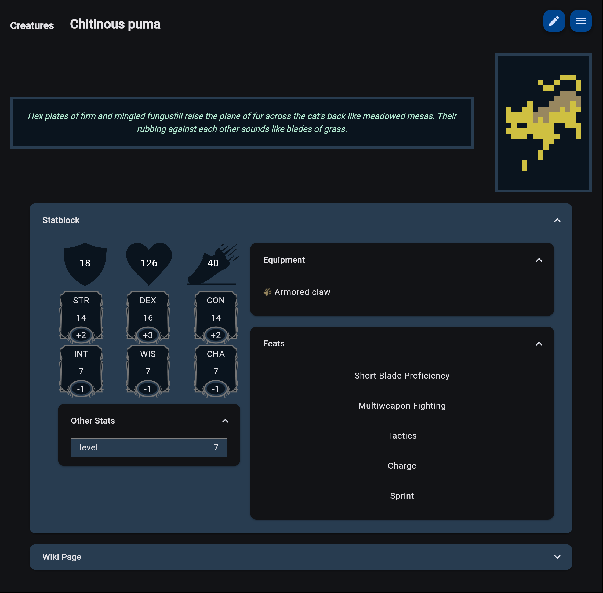
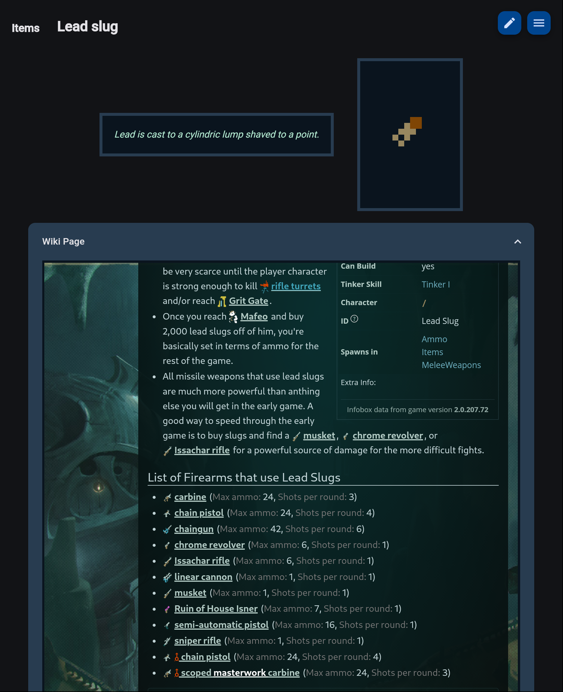

# quDnD
A stat generator/wiki browser for Caves of Qud that can create equivalent DnD statblocks on the fly.

## Features

### Creature Statblocks, Equipment and Feats

### Embedded Wiki Page for Reference

## More to do
* Equipment stats (AC, damage, special effects)
* Links to equipment pages in creature statblocks
* Inventory item lists or examples for merchants
* Starting gear examples for creatures
* Ability to tweak stats and create custom pages
* Ability to save + load those custom pages
