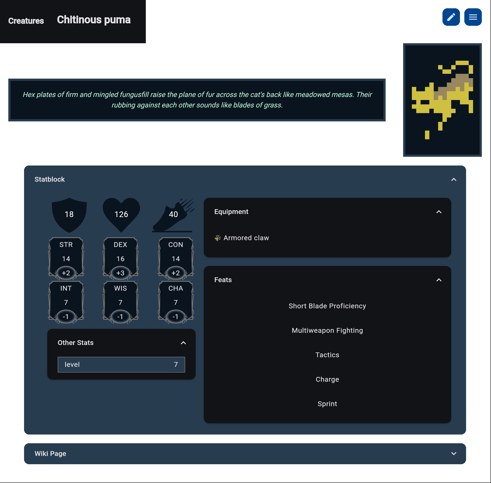
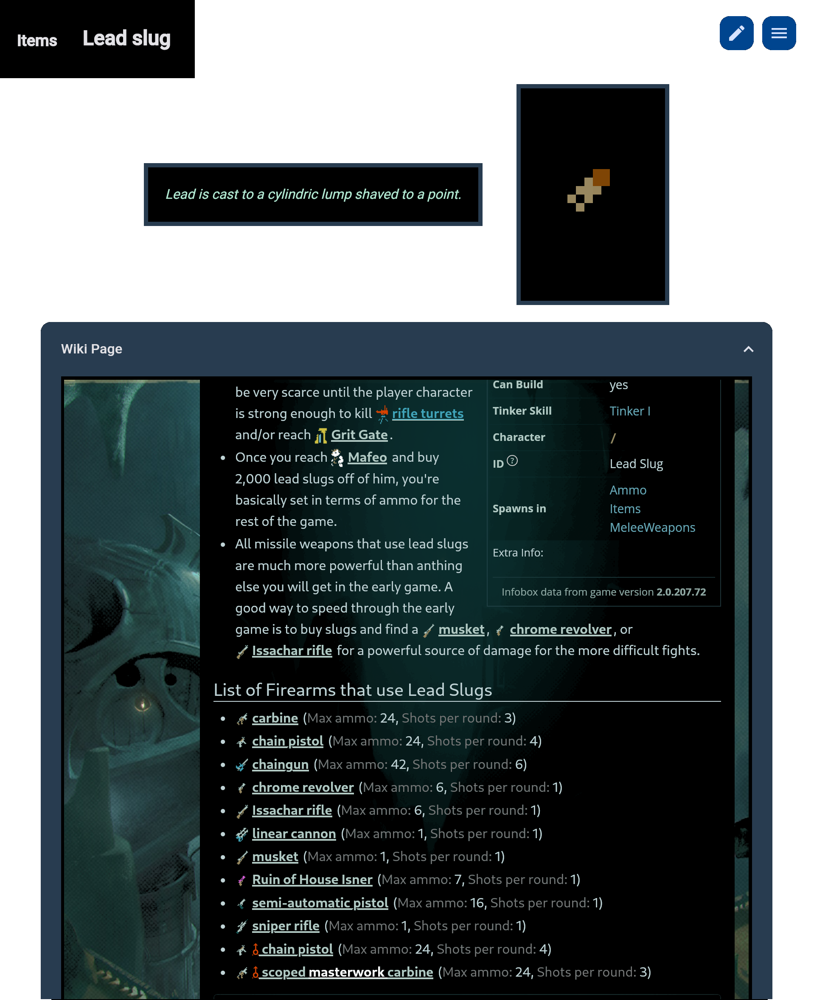

# quDnD
A stat generator/wiki browser for Caves of Qud that can create equivalent DnD statblocks on the fly.

## Features
### New! Tabs!
Tabs are automatically created when you visit a page.
When closed, you can bring them back up with Ctrl+Shift+T!

Tab Keybinds:
* Navigate Left/Right: Ctrl+Shift+Tab/Ctrl+Tab
* Close Tab: Ctrl+W
* Open last closed tab: Ctrl+Shift+T

Tabs can also be reorganised by dragging them into place.

### Creature Statblocks, Equipment and Feats

### Embedded Wiki Page for Reference

### Hidden Features (ooo!)
#### Page Caching
Any page that's been visited before has its statblock stored in an SQLite database,
making things quicker and reducing the load on the Caves of Qud Wiki servers :sweat_smile:

#### Category cache
A list of basic information (pageid and title) about all pages is automatically grabbed
and cached from the wiki servers, to avoid expensive calls to find out how to categorise
pages later.

At the moment this is used for typeahead search and to find the category of pages, but
I may remove categorisation entirely later on now that tabs exist.

## More to do
* Equipment stats (AC, damage, special effects)
* Links to equipment pages in creature statblocks
* Inventory item lists or examples for merchants
* Starting gear examples for creatures
* Ability to tweak stats and create custom pages
* Ability to save + load those custom pages

------

> [!NOTE]
> This project is in no way affiliated with Freehold Games or Kitfox Games.
